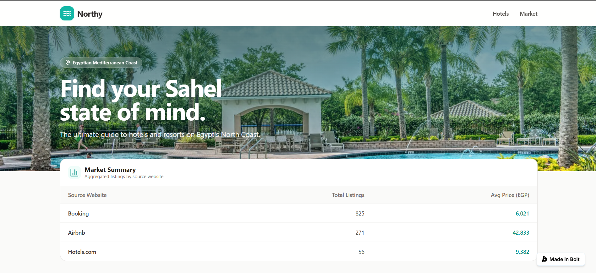
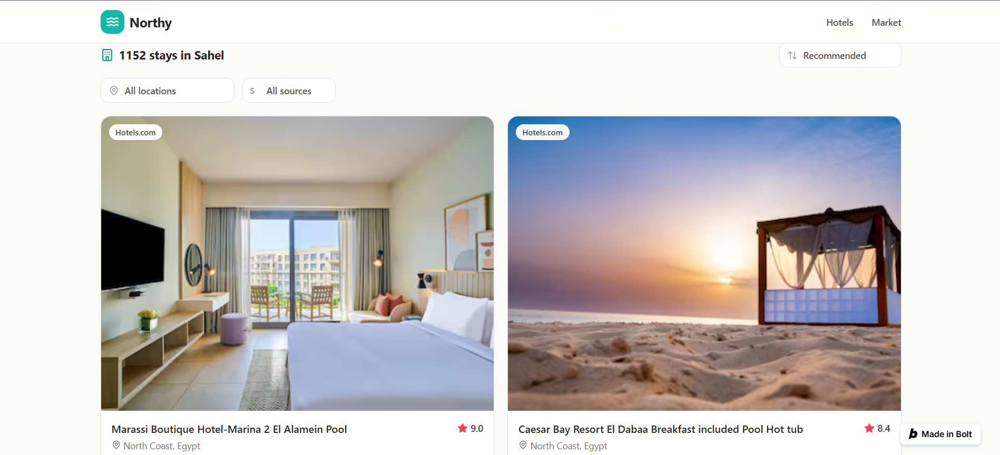
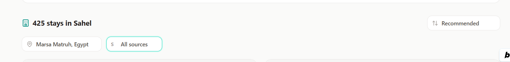
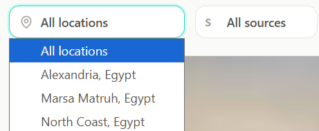
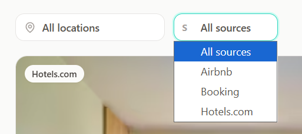

# Northy 🌊
**Egypt Coastal Hotels Market Intelligence**

🔗 **Live Website:** [https://northy-hotel-directo-4qul.bolt.host]

## 📖 Overview
Northy is a comprehensive market intelligence dashboard and data pipeline built to track and visualize hotel data across the North Coast of Egypt, Alexandria, and Marsa Matruh. The project aggregates listings from major booking platforms like Airbnb, Booking, and Hotels.com to provide insights into pricing trends, hotel ratings, and overall market composition.

## ✨ Features
* **Data Processing Pipeline**: Structured data layers following a Medallion architecture (Silver and Gold) for clean granular listings and aggregated market metrics.
* **Interactive Dashboard**: A responsive, custom-built HTML/CSS/JS dashboard tracking Key Performance Indicators (KPIs).
* **Live Slicing & Filtering**: Filter the market data dynamically by destination, source website, and rating bands.
* **Market Insights**: Real-time KPI tracking for Total Listings, Average Price per Night, Median Price, and Average Rating.

## 📂 Repository Structure

### 1. Data Engineering Layers
* **`data/Silver_Layer (1).csv`**: Contains the cleaned, granular listing data. Key columns include hotel `name`, `destination`, `price_egp`, `rating`, `url`, `source_website`, and `image_url`.
* **`data/Gold_Layer (1).csv`**: Contains the aggregated, presentation-ready market data. It summarizes `total_hotels`, `avg_price`, and `avg_rating` categorized by destination and source website.

### 2. Front-End Dashboard
* **`dashboard/Egypt_Hotels_PowerBI_Dashboard.html`**: The interactive user interface visualizing the processed data through scatter charts, bar charts, and KPI cards.

## 🚀 How to Access the Dashboard
You do not need to download or clone any files to explore the data! 

Simply visit the live interactive dashboard here: **[Insert your website link here]**

## 📊 Visuals & Screenshots

* **Secondary Interface Overview:** 

* **Filtered Hotels View:** 

* **Location Filters in Action:** 

* **Source Filters in Action:** 

## 🛠️ Built With
* **Data Processing:** Python / Pandas
* **Front-End:** HTML5, CSS3, JavaScript (Vanilla JS / Chart.js)
* **Design System:** Fraunces & Inter fonts, FontAwesome icons
